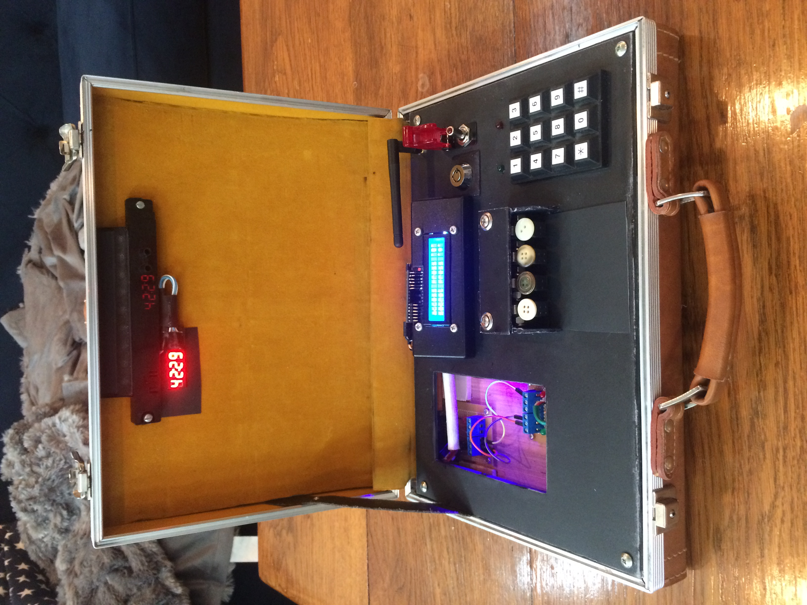

# Lose or Defuse

🚨 WARNING! Don't do anything illegal! Check the laws in your jurisdiction before building or transporting this device! 🚨  
⚠️ CAUTION! This repo and included code is out of date with final specs listed below. Libraries are missing as well. Will revise with the next prototype build. ⚠️

"Lose or Defuse" is a physical game that simulates the experience of defusing a bomb. It's designed to provide players with an exciting and suspenseful experience, similar to what you might see in action movies. The game is timed and players have only 3 lives, adding to the pressure and excitement. The game also has customizable settings, so you can play multiple rounds and have different experiences each time. To win, players must correctly enter a pin number, press a sequence of labeled buttons and cut or disconnect the correct wire. The game offers a fun and challenging experience that tests player's nerves and skills.

This repo contains the Arudino control software and build instructions/options for the game hardware. 

Use cases:
* Escape rooms
* Paintball CTF
* Employee team building
* Family game night

## How it works

### Prerequisites
* Install or reset the "cut wires" before turning on device.

### Initialization
1. Device is powered on by the keyed switch
1. Installed "Cut wires" detected by logic board
1. Arduino pins are set
1. hd44780 displays setup prompt
1. Device waits for key input to start setup

### Setup
1. User selects the "cut wire"
1. User sets 4 digit pin for keypad 
1. User sets timer (1-99 minute(s)) 

### Features
* Tamper proof keyed power switch
* Fully(almost) configurable options on start up
* Cut a wire just like in the movies 📽
* Three "lives"
* Sassy and eccentric onscreen dialog

## How it's made

### Software
Built in Arduino C. 

### Hardware

#### Electrical
<!-- add board revision model -->
* Arduino Mega 2560 
* Hitachi 16x4 LCD
* 4 digit timer LCD
* Belkin battery bank (inaccessible battery bank needs to be able to detect current draw)
* 10 key keypad
* 4x cherry long throw rocker switches
* 4x buttons off an old shirt or jacket
* Belkin USB power bank
* LED Rocker Switch
* Larson Scanner Kit
* 1x Red LED
* 1x Green LED

## Future Optimizations
This was a prototype build and some of the messiest code I have ever written. 🍝 

### Next version

* Handcrafted components and brackets will be recreated as 3d printed models. 
* Companion website/app to generate storylines and automated presets for game logic. 
* Modular design to fit in a standard sized waterproof case. 
* Larger LCD for countdown timer. 
* Intrusion switch detection.
* Use of off the shelf i2c solutions to simplify layout and cabling
* Adapting design to use a smaller Uno or Nano board.

#### Finale

* LiPo battery system to allow higher current draw for a vibrating motor on "detonation"
* Upgraded sound system (louder and with wav file playback support.)

## Installation
Download all files from `/src`, libraries(not included), and flash to Arduino over USB. 
